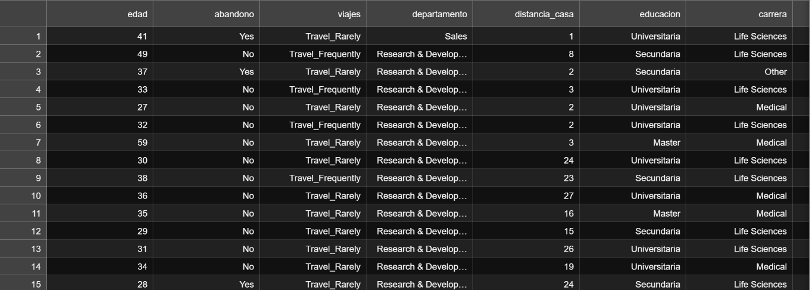
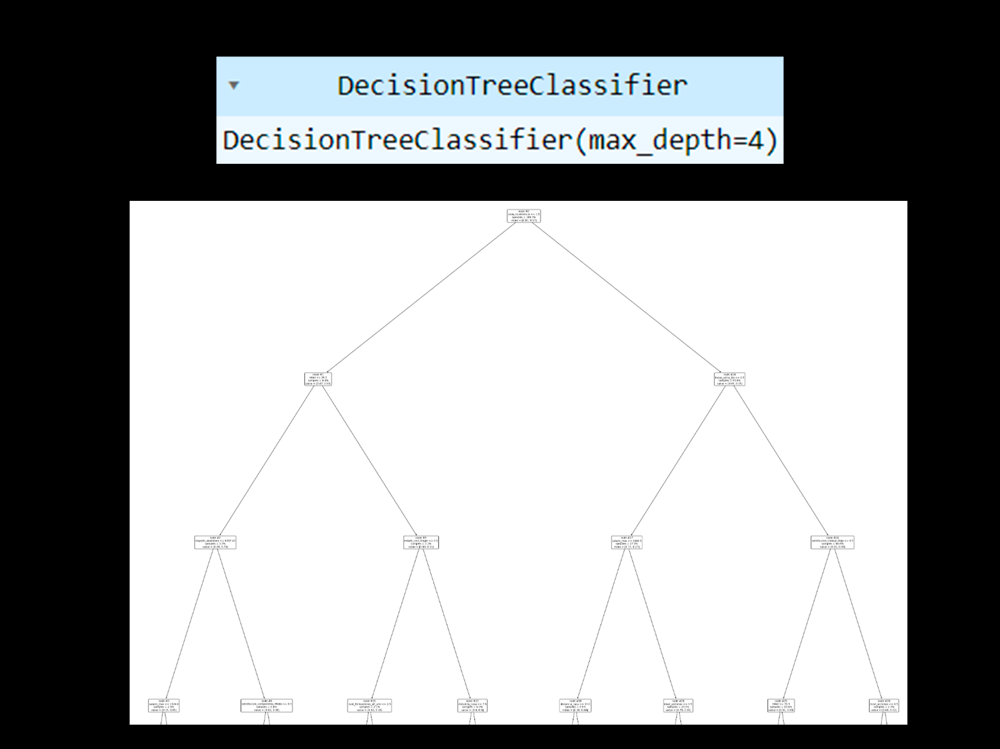
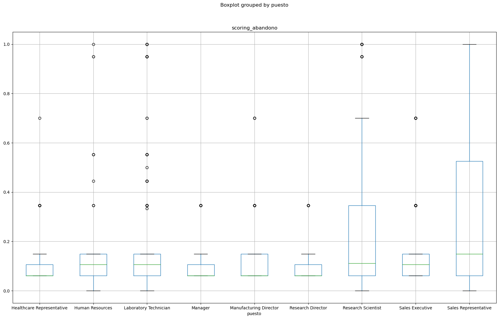

# Rotacion_Empleados_XYZ
Este proyecto destaca la importancia de la rotación de empleados a través del analisis de datos utilizando Python y modelos de clasficacicion como el DecissionTreeClassifier

En ocasiones, inadvertidamente minimicé la importancia del área de Recursos Humanos, al asociar la creación de valor exclusivamente con el aumento de ingresos.

Esta percepción limitada me llevó a subestimar la función de los profesionales en Recursos Humanos, quienes, a mi entender, se ocupaban mayormente de tareas administrativas, como mantener la moral de los empleados, gestionar nóminas y realizar procesos de selección prolongados.

Sin embargo, con el tiempo he llegado a comprender que esta perspectiva estrecha no refleja la verdadera magnitud y contribución estratégica que aporta el área de Recursos Humanos a las empresas.

La gestión efectiva de las dinámicas humanas, la construcción de culturas inclusivas y la promoción de ambientes laborales positivos son aspectos fundamentales que influyen directamente en el éxito y la sostenibilidad de cualquier organización.

Existe una frase muy celebre en el mundo empresarial sobre la renuncia y los despidos de perosnal

UN JEFE:

«En esta empresa, Nadie es indispenasble»

Es decir cualquier persona puede ser reemplazada. Pero hasta que punto se le generan altos costos a las empresas para recontratar nuevo personal y entrenarlos, gastando tiempo y dinero.

En la empresa XYZ no se tomaba como importante la rotación de personal, pero todo eso cambió hasta que comenzamos a ANALIZAR LOS DATOS

Según el estudio «Cost of Turnover» del Center for American Progress:

El coste de la fuga de los empleados que ganan menos de 30000 es del 16,1% de su salario
El coste de la fuga de los empleados que ganan entre 30000-50000 es del 19,7% de su salario
El coste de la fuga de los empleados que ganan entre 50000-75000 es del 20,4% de su salario
El coste de la fuga de los empleados que ganan más de 75000 es del 21% de su salario

Cuantificación del problema: ¿Cual es la tasa de abandono?

No     83.877551
Yes    16.122449

¿Hay un perfil tipo de empleado que deja la empresa?

El perfil medio del empleado que deja la empresa es:

- Bajo nivel educativo
- Soltero
- Trabaja en ventas
- Bajo salario
- Alta carga de horas extras

¿Cúanto nos ha costado este problema en el último año?

2719005.912

Cuanto nos cuesta que los empleados no estén motivados? (pérdidas en implicación == Baja)

368672.688

¿Cuanto dinero podríamos ahorrar fidelizando mejor a nuestros empleados?

Reducir un 10% la fuga de empleados nos ahorraría 271900$ cada año.
Reducir un 20% la fuga de empleados nos ahorraría 543801$ cada año.
Reducir un 30% la fuga de empleados nos ahorraría 815701$ cada año.
Para este punto ya tenemos conocimiento suficiente para proponer que estrategias tomaremos y así mismo saber cuánto dinero nos podemos ahorrar

A continuación, utilizaremos el poder de machine learning creando un modelo de clasificación a través del DecisionTreeClassifier.

Importancia de las variables

1. años_experiencia
2. salario_mes
3. horas_extras_no
4. nivel_acciones
5. edad
6. distancia_casa
7. satisfaccion_compañeros_media
8. satisfaccion_trabajo_baja
9. impacto_abandono
10. estado_civil_single
11. num_formaciones_ult_ano

Conclusión:
Entre las variables destacadas se encuentran años de experiencia, salario mensual, horas extras, nivel de acciones, edad, distancia desde casa, satisfacción con compañeros y trabajo, impacto de abandono, estado civil, y número de formaciones en el último año. Este enfoque reveló valiosas percepciones sobre los factores clave que contribuyen al riesgo de rotación en la empresa.

Un hallazgo significativo del análisis fue que el área de Sales Representatives emergió como la más propensa al abandono, según el scoring resultante. Este descubrimiento tiene implicaciones directas para la gestión de recursos humanos, señalando la necesidad de intervenciones específicas para mejorar la retención en este segmento crucial del personal.

Este estudio no solo destaca la importancia de las variables mencionadas sino también proporciona una base valiosa para la implementación de estrategias personalizadas de retención de empleados, permitiendo a la empresa XYZ abordar proactivamente los desafíos de rotación y fomentar un entorno laboral más estable y productivo.
